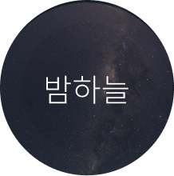
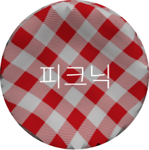
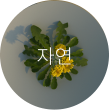

# Delight

제스처 기반 테이블 프로젝션 다이닝 경험 프로토타입

> 무인화된 외식 환경에서 사라진 대접과 분위기를, 테이블이 먼저 알아보고 반응하는 경험으로 다시 돌려주기 위한 프로젝트입니다.

Delight는 주문을 더 빠르게 처리하는 인터페이스가 아니라, 식사 전 과정을 조금 더 환대받는 시간으로 바꾸기 위한 실험입니다. 손님의 존재를 알아차리고, 관계와 상황에 맞게 분위기를 바꾸며, 주문 과정마저도 하나의 대화처럼 느껴지게 만드는 것이 이 프로젝트의 출발점입니다.

더 자세한 원문 히스토리와 리서치 차트는 [docs/delight-history.md](docs/delight-history.md)에서 확인할 수 있습니다.

<table>
  <tr>
    <td align="center" width="33%">
      
      <br />
      <sub>손끝으로 시작되는 첫 반응</sub>
    </td>
    <td align="center" width="33%">
      
      <br />
      <sub>테이블 위의 개인화된 분위기</sub>
    </td>
    <td align="center" width="33%">
      
      <br />
      <sub>경험의 끝에서 만나는 메뉴</sub>
    </td>
  </tr>
</table>

## Hero

Delight가 상상하는 레스토랑의 미래는 더 많은 자동화가 아니라, 더 섬세한 환대입니다. 손님이 들어오면 테이블이 먼저 존재를 알아보고, 손짓 하나에 반응하며, 식사의 분위기와 대화의 결을 함께 만들어가는 경험. 이 프로젝트는 주문 이전의 시간부터 식사가 끝난 뒤의 여운까지, 한 끼를 조금 더 따뜻하게 기억하게 만드는 장면을 설계합니다.

## Why Delight

외식은 단순히 음식을 소비하는 행위가 아니라, 누구와 어떤 분위기 속에서 시간을 보내는가에 더 가까운 경험입니다. 많은 사람에게 식사는 하루의 휴식이자 관계를 확인하는 순간이고, 그 시간의 결은 음식만으로 완성되지 않습니다.

하지만 키오스크와 자동화 시스템이 일상이 된 이후, 주문은 편해졌지만 손님을 알아봐주고 맞아주는 감각은 점점 약해졌습니다. 빠르고 효율적인 인터페이스는 남았지만, 그 자리에 있어야 할 인사, 안내, 맥락 있는 반응은 쉽게 사라졌습니다.

Delight는 이 공백을 테이블 자체가 메우도록 설계했습니다. 챗봇이나 태블릿처럼 화면 안에만 머무는 개입이 아니라, 식사 공간 전체의 분위기를 바꿀 수 있는 매체로 프로젝션을 선택했고, 손님의 움직임과 상황에 반응하는 경험을 통해 다시 대접받는 감각을 회복하고자 했습니다.

## Design Principles

### Recognize Presence

대접은 손님의 존재를 알아차리는 것에서 시작됩니다. Delight는 사용자가 먼저 메뉴를 배우기 전에, 테이블이 먼저 손님의 도착과 움직임을 인지하는 흐름을 중요하게 봅니다.

### Personalize Atmosphere

같은 음식이라도 누구와 어떤 상황에서 먹느냐에 따라 경험은 달라집니다. Delight는 관계, 목적, 무드 선택에 따라 테이블의 분위기를 바꾸며 식사 공간을 더 개인적인 장면으로 전환합니다.

### Make Interaction Feel Like Hospitality

조작은 기능적일 수 있지만, 대접은 감정적으로 기억됩니다. 그래서 Delight의 상호작용은 명령을 수행하는 UI가 아니라, 질문을 건네고 반응을 돌려주며 식사를 함께 준비하는 경험처럼 느껴지도록 구성했습니다.

## Experience Flow

1. 입장 인식: 테이블이 손님의 등장을 감지하고 경험을 시작합니다.
2. 제스처 안내: 손가락을 펴면 포인터가 움직이고, 주먹을 쥐면 선택이 이루어집니다.
3. 대화형 질문: 방문 목적, 관계, 상황을 자연스럽게 묻고 답하게 합니다.
4. 메뉴 추천: 대화와 맥락을 바탕으로 지금의 식사에 어울리는 메뉴를 제안합니다.
5. 북 형태 주문: 메뉴를 책처럼 넘기며 읽고, 선택하고, 주문합니다.
6. 무드 선택: 식사 분위기에 맞는 테이블 테마를 직접 고릅니다.
7. 식후 경험 회고: 식사가 끝난 뒤 오늘의 경험을 간단히 남길 수 있습니다.

## Key Interactions

### 제스처는 조작이 아니라 초대처럼 시작됩니다

처음 만나는 사용자는 마우스나 버튼 대신 자신의 손으로 테이블과 관계를 맺습니다. 손가락을 펴면 포인터가 부드럽게 이동하고, 주먹을 쥐면 클릭이 발생합니다. Delight는 이 기본 동작만으로도 사용자가 시스템을 배운다기보다 공간과 호흡을 맞춘다는 느낌을 주고자 했습니다.

<table>
  <tr>
    <td align="center" width="50%">
      
      <br />
      <sub>Move: 손가락을 펴서 포인터를 움직입니다</sub>
    </td>
    <td align="center" width="50%">
      
      <br />
      <sub>Click: 주먹을 쥐어 선택합니다</sub>
    </td>
  </tr>
</table>

### 질문은 입력이 아니라 관계를 읽기 위한 장치입니다

방문 목적, 함께 온 사람, 지금의 상황을 묻는 흐름은 단순한 폼 입력이 아닙니다. Delight는 이 대화를 통해 손님을 하나의 주문 데이터가 아니라 맥락을 가진 존재로 파악하고, 이후의 추천과 분위기 전환에 그 맥락을 반영합니다.

### 주문은 정보 탐색이 아니라 식사의 기대를 높이는 장면입니다

추천된 메뉴와 전체 메뉴는 북 형태 인터페이스 안에서 탐색됩니다. 사용자는 메뉴를 빠르게 스캔하는 대신, 설명과 이미지를 넘겨보며 지금의 식사에 어울리는 선택을 천천히 고를 수 있습니다.

## Atmosphere & Personalization

Delight에서 무드는 배경 장식이 아니라 대접의 언어입니다. 같은 테이블이라도 피크닉처럼 가볍게, 밤하늘처럼 차분하게, 모던하게 정제된 장면으로 바뀔 수 있습니다. 사용자가 선택한 분위기는 테이블 전체의 인상을 바꾸고, 식사 시간을 조금 더 자신만의 경험으로 만듭니다.

<p align="center">
  
  
  
  
</p>

이 개인화는 단지 보기 좋은 화면을 만드는 데서 멈추지 않습니다. 테이블이 어떤 질문을 던졌는지, 어떤 메뉴가 선택되었는지, 어떤 분위기가 어울렸는지를 함께 엮어, 손님마다 다른 식사 경험의 결을 만드는 것이 Delight가 지향하는 핵심입니다.

## Technical Appendix

- 실행: `npm install` 후 `npm start`
- Frontend: `React`, `react-router-dom`, `framer-motion`
- 3D and motion: `three`, `@react-three/fiber`, `@react-three/drei`, `framer-motion-3d`
- Interaction flow: 제스처 안내, 질문형 UI, 북 형태 주문, 무드 선택을 하나의 시퀀스로 연결
- Data layer: `Firebase Realtime Database`를 통해 테이블 상태와 상호작용 흐름을 관리
=======
# our_project

`src/`, `app/`, `frontend/` 실제 소스 디렉터리를 포함한 상태로 재점검했습니다.

## 점검 대상 파일 경로

- `src/main.py`: 빌드/실행 진입점
- `app/service.py`: 입력값 검증, 예외 처리, 에러 핸들링
- `frontend/index.html`: 프런트엔드 접근성/UX 점검 대상

## 실행 방법 (재현 절차)

### 1) Python 실행 진입점 확인

```bash
python3 src/main.py
```

기본적으로 `config.json`이 없으면 에러를 출력하고 종료 코드 `1`을 반환합니다.

### 2) 정상 입력으로 실행 확인

```bash
cat > config.json <<'EOF'
{"username": "user_01", "retry_count": 2}
EOF
python3 src/main.py
```

정상 메시지를 출력하고 종료 코드 `0`을 반환합니다.

### 3) 프런트엔드 확인

```bash
python3 -m http.server 8000
# 브라우저에서 http://localhost:8000/frontend/index.html 접속
```

## 재점검 결과

### 1. 빌드/실행 진입점 존재 여부

- `src/main.py`에 `main()` 함수 및 `if __name__ == "__main__"` 진입점이 존재합니다.

### 2. 에러 핸들링 누락 구간

- `app/service.py`에서 파일 없음(`FileNotFoundError`), JSON 파싱 오류(`JSONDecodeError`), 필수 키 누락(`KeyError`)을 각각 처리합니다.
- 검증 오류는 `RuntimeError`로 변환되어 `run_app()`에서 사용자 친화 메시지로 출력됩니다.

### 3. 입력값 검증/예외 처리

- `username`: 공백/길이/허용 문자셋을 검증합니다.
- `retry_count`: 0~5 범위만 허용합니다.

### 4. 보안상 위험한 하드코딩(키/토큰/비밀번호)

- 점검 파일에서 키/토큰/비밀번호 하드코딩은 발견되지 않았습니다.
- 설정값은 `config.json` 입력 기반으로만 로드되며 비밀정보 상수는 없습니다.

### 5. 프런트엔드 접근성/UX 흐름

- 키보드 탐색: Skip link, focus outline 제공.
- 라벨: `label for`와 `aria-describedby` 사용.
- 대비/가독성: 밝은 배경 대비의 텍스트 및 버튼 색상 사용.
- UX 흐름: 제출 결과를 `role="status"` + `aria-live="polite"`로 안내.
>>>>>>> theirs
