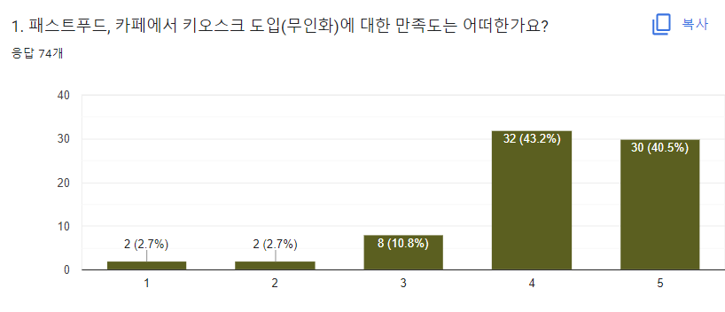
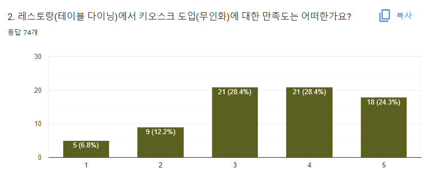

# Delight History

> 이 문서는 Notion 원문을 Markdown 문서에 맞게 다시 배치한 기록입니다. 문장 자체는 가능한 한 원문을 유지하고, 제목, 목록, 토글, 콜아웃 형식만 Markdown 친화적으로 정리했습니다.

## 📚 Source

- [Delight](https://www.notion.so/dosigner/Delight-e5b2b723c19f4a629c099669189eda9f)
- [Just My Voyage](https://www.notion.so/dosigner/Just-My-Voyage-3b01c4b12d784ff88ee6d59b20ea38f8)
- [Portfolio README](../README.md)

---

## ✨ Delight

### 음식점의 고객경험관리를 위한 프로젝션 테이블

김동주, 홍화정

요리(料理), 헤아릴 요, 다스릴 리.

맛이 주는 가치는 시간에 따라 변할 수 있지만, 불변의 가치는 식사 상황과 분위기에 맞게 대접하는 것입니다.

코로나19 이후 음식점에서 무인화가 가속화되어 키오스크는 어느새 일상의 한 부분으로 자리 잡게 되었습니다.
획일화된 무인 시스템의 도입 이면에는 외식 문화에서 인사, 안내 등 기본적인 대접마저도 점점 사라지게 되었고 테이블에서의 소통은 단절되었습니다.

아무리 좋은 맛을 느껴도 상황과 분위기에 맞는 서비스를 받지 못한다면 고객의 만족도는 떨어지기 마련입니다.

이에 Delight는 느슨한 연대감을 형성하면서 개인화, 대접 두 가치를 고객에게 다시 돌려주고자 하는 테이블 프로젝션 조명입니다.

대접은 고객의 존재를 알아차리는 것에서 시작됩니다.

Delight의 컴퓨터 비전 기술은 테이블의 상황과 고객의 인터렉션에 반응하며 메뉴 고르는 과정을 함께합니다.
이 과정을 통해 고객 유형을 분석하고 경험 데이터가 관리됩니다.

프로젝션은 테이블 전체 테마에 변화를 줄 수 있어 테이블별로 개인화된 경험을 제공하게 됩니다.

소중한 식사 한 끼. 여러분에게 더욱 기쁨을 줄 수 있도록.

---

## 🧭 프로젝트 소개

코로나 이후 어느 덧 우리의 삶에서 무인 시스템이 일상을 자리를 잡게 되었습니다.

포스트 코로나 시대에는 벗어날 것만 같았던 비대면의 삶이 어느새 삶 자체가 되어 사람들은 기존의 관성을 버리지 않습니다.

### 🥀 사라진 대접 문화

코로나 펜데믹 이후 키오스크 도입으로 인해 무인화의 가속화가 이루어졌고 어느새 우리의 일상이 되어버렸습니다.

획일화된 시스템 도입의 이면에는 요식업에서 점원과의 교류와 대접은 점점 사라지고 있습니다.

음식점에 들어갔는데 인사, 안내의 부재와 딱딱한 키오스크의 인터랙션은 손님에 대한 대접이 소홀하다는 생각이 들게 할 수 있습니다.

아무리 좋은 맛을 느껴도 좋은 서비스를 받지 못한다면 고객의 만족도는 떨어지기 마련입니다.

**많은 사람들은 더 정을 주는 곳에 충성심을 갖고 대접받기를 원하지만, 모순적이게도 단절된 소통에 익숙해졌습니다.**

### 🤝 손님을 알아주고 이해하는 것

요리, 요식업에서 요자는 헤아릴 요입니다.

맛이 주는 가치는 시간에 따라 변화할 수 있지만 불변의 가치는 식사 상황을 헤아리고 그에 맞게 대접하는 것입니다.
그 시작점은 손님을 알아 봐주는 것에서 출발합니다.

Delight의 컴퓨터 비전 기술을 통해 손님은 모션을 통해 쉽게 프로젝션의 화면을 제어할 수 있습니다.
동시에 테이블을 통해 보여지는 반응 인터랙션들은 손님으로써 존재감을 느끼게 해주며 재미를 안겨줍니다.

Delight는 가상의 agent가 전체 테이블 속에 있기에 물리적 관계 형성 없이도 느슨한 연대감을 가지면서도 대접의 가치를 제공합니다.

### 🛠️ 새로운 고객경험관리 도구

Delight는 프로젝션 속에서 손님과의 대화를 통해 같이 음식을 고민을 해주면서 고객 유형을 분석합니다.

인터랙션을 통해 발생되는 데이터는 고객 경험 데이터로써 관리될 수 있습니다.
또한 프로젝션이 테이블의 전체 테마에 변화를 줄 수 있어 테이블별로 고객은 개인화된 경험을 제공받을 수 있습니다.

Delight는 고객의 식사 과정에서 행동과 의중을 총체적으로 파악할 수 있고 고객 중심, 관계지향적 서비스 제공의 목표를 달성할 수 있게 됩니다.

### 🌱 요식업의 새로운 미래

Delight는 개인화된 테이블 경험을 제공하며 고객경험 데이터를 수집하여 경험을 전략적으로 관리할 수 있게 됩니다.

또한 개인화된 분위기의 테이블들은 미래의 공유 경제에서 셰어홀(Shared Hall) 형태의 새로운 서비스를 만들어 낼 수 있습니다.
기존 획일화된 카페테리아의 모습을 탈피하여 전혀 다른 요식업종들이 공용의 테이블 공간을 사용하면서도 각 테이블마다 제공되는 맞춤형 분위기는 개인화된 식사 공간을 만들게 됩니다.

가게들이 공간을 유연하게 사용하여 요식업 창업자의 초기 비용을 줄일 수 있게 도와주고 공간을 보다 더 효율적으로 만들어 줄 것입니다.

---

## Just My Voyage

### 00. Starting Point

**Q. 나는 결국 어떤 디자인을 하고 싶은가?**

많은 이들이 지나쳐간 문제를 재발견하고,
많은 이들이 공감하며 내가 조금이나마 해결했으면 좋겠다.

**Q. Living in the Future 전시의 궁극적인 목적?**

급변하는 세상 속에 더 나은 경험 또는 따뜻한 사회를 만들기 위한 **우리의 수 많은 고민, 노력의 과정**과 **그 결과**를 알리는 것

### 01. Prior Knowledge

식당은 음식, 메뉴에 따라 업종이 달라지고, 제공할 서비스 형태(업태)에 따라 부류가 나뉜다.

업태에 따라 크게 아래와 같이 3가지로 나뉠 수 있다.

**1) Fine Dining :** 최고급 레스토랑을 뜻하며, 고객에게 최상의 가치를 제공한다. 맛은 기본적으로 충실하며 아름다운 장식, 즐거움을 만끽할 수 있는 분위기, 최상의 대우를 제공하는 서비스까지 모든 것이 조화를 이루어 최고의 경험을 누릴 수 있다.

**2) Casual Dining :** 높은 수준의 테이블 풀 서비스를 제공하면서, 가격 면에서 Fine dining보다 저렴하며 고객층이 두텁다는 장점이 있다. 회전율이 낫다. 혼자 오는 고객이 드물다.

**3) Quick Service :** 퀵 서비스 레스토랑은 간편함과 스피드에 목적을 둔다. 레스토랑의 인테리어도 간단하고 저렴한 메뉴 무엇보다 빠른 카운터 서비스를 제공한다. 대부분의 패스트 푸드 레스토랑이 여기에 속한다.

위와 같이 정형화된 서비스 형태 이외에도 **셀프 서비스, 반 셀프 서비스** 등이 **레스토랑의 자동화, 획일화** 시도가 늘어나고 있다.

**Q. 요식업에서 레스토랑의 특징은?**

현대의 레스토랑은 단순한 음식물 제공의 장소라기보다 일종의 사교의 장

- 고객은 좀 더 세련되고 차별화된 접객매너와 분위기를 만나고 싶어한다.
- 고객은 종업원에게 단순 주문접수나 음식물 서빙의 역할을 기대하는 것이 아님
- 고객의 목적은 종업원과의 인간적 커뮤니케이션을 통해 자신의 존재를 사회적으로 확인.

**자신만의 대우**를 받고 있다고 생각하도록 만들어주는 것.

### 02. Simple User Interview

> 🙍‍♂️ **Q. 나에게 식사는 어떤 의미일까?**
>
> 무엇을 먹는지는 사실 나에겐 중요하지 않다. 누구와 먹는지가 더 중요하다.
> 나에게는 음식이 소모 대상이 아니라 식사 시간이 소모 대상이다.

> 👩‍👩‍👧‍👧 **Q. 당신에게 식사의 의미?**
>
> 유일한 휴식 시간
> 배고픔을 달래주는 시간
> 이야기 나누는 시간
> 대부분 힘든 시간을 버텼기 때문에 정말 맛있게 먹어야 하루 전체가 행복해지는 그런 시간
> 나는 먹기 위해 존재한다.
> 먹는 것보다 뭐 먹을지 더 오래 걸린다
> 밥한끼 먹자. 안부인사
> ….

→ 크게 2가지 부류

- 맛을 온전히 즐기는 사람
  - 더욱 맛있는 집을 찾기 위해 노력하고, 각 음식점을 평가하고 공유한다.
- 그 시간 자체를 즐기려고 하는 사람
  - 상대방과 어떤 분위기에 맞는 공간을 가고, 어떻게 그 순간을 남길지 고민. 그리고 공유

**Q. 외식에 있어서 맛, 인테리어, 대화, 같이 먹는 사람 중 어떤 게 더 중요한지?**

- 대부분 **같이 먹는 사람**을 택하였다.
  - 대화는 결국 사람이 자신이 편안하다고 여기는 사람이라면 자연스럽게 따라오는 요소
- 지금은 배달, 밀키트 같은 집에서 쉽게 다양한 음식을 즐길 수 있기에, 이제는 외식을 한다는 것은 **누군가와 시간을 나누는 것**이고 새로운 분위기, 공간 등에 초점이 맞춰지게 되다.

→ 코로나 19가 초래한 사회적 거리두기로 인해 **2, 4인 사적모임 제한 조치**는 이전에 우리가 쉽게 할 수 있었던 **외식과 모임이 당연시되는 것**이 아니라 조금 더 가치 있음을, 흔치 않은 기회임을 느끼게 해주었다. → 외식에서도 보복 소비(비싼 음식점)가 증가하는 근거 중 하나일 수도

### 03. Background ( desk research )

년도별 그래프에서 보다시피, 카페, 패스트 푸드에는 획일화되 키오스크 시스템이 이미 많이 도입되었고, 레스토랑에서도 도입이 늘어나고 있는 추세입니다.

As you now, 키오스크 시스템은 주문 처리 시간 단축과 결제, 서빙 등 부가 서비스를 줄이는 목적으로 개발되어 왔습니다.

저는 이부분에서 3가지의 의문이 들었습니다.

1. 테이블 시간이 길고 경험이 중시되는 레스토랑에 도입은 적절한가?
2. 어쩌면 대접이라는 본질을 잃고 무분별하게 무인화가 이루어지고 있는 것은 아닌가?
3. 사회적 거리두기는 외식이 흔한 것이 아닌 귀중한 시간임을 느끼게 해주었다. 그럼 더욱 immersive하고 개인화된 새로운 경험을 사람들이 원하지 않을까?

질문에 답을 찾고자 우선, 유저들이 패스트푸드, 카페와 레스토랑 각각에서의 키오스크 도입에 대해 다른 만족도를 실제로 느끼고 있는지 조사했다.

  
  

그 결과, 두 그래프의 차이를 통해 키오스크의 도입은 레스토랑에서 큰 만족도를 느끼지 못함을 보여주고 있습니다.

인용하면, 레스토랑은 단지 맛있는 음식을 제공하는 곳만이 아닌 음식을 통해 환대를 베풀고 “접객”을 하는 곳입니다.

하지만, 무인 키오스크로 인해 레스토랑에서 고객의 전체적인 식사 관리를 하는 경험을 **불연속적이게 만들었고**, 따뜻한 환대의 느낌은 사라졌습니다.

응답그래프도 같은 결과를 말해줍니다.

---

## 🎯 Design Direction

- 제품이 느낄 수 있는 능력(**Sensibility**)을 갖출 수 있도록
- 고객도 테이블에서 자신의 존재를 알 수 있도록

우리는 사람이 있는 듯한 느낌을 **인기척**이라 부른다. 우리들만이 놓여진 공간에 누군가 온다면.

어떻게 보면 식당에서 점원이 오는 것이 그 테이블의 **atmosphere**(분위기, 대기)에 변화를 준다.

→ 우리와 그 행동을 인지하고 전체적인 분위기 또는 지속적이고 작은 디테일 변화에 감동을 선사할 수 잇다면 이를 감성적이라고 여기서 정의한다. ex) 애플의 dynamic island

## 🧠 Design Rationale

다시 돌아와 대접의 시작은 손님을 알아주고 그 후 그들에 맞는 변화가 첫 단계라고 생각한다.

챗봇, 로봇, 태블릿은 식사 분위기에 큰 intervention을 **줄 수 없다.**

테이블의 분위기에 영향을 줄 수 있는 요인으로는 크게 사람, 인테리어, 조명이 있다.

식사 상황에 맞게 큰 스케일의 다양한 콘텐츠를 제공하기 위한 수단으로 **프로젝션**이 적절하다.

## 🌈 Design Vision

**레스토랑에서 대접과 개인화된 분위기를 제공하는 테이블 프로젝션 디자인 솔루션**을 제안하다.

## 🧭 Service Target

**머무는 시간이 비교적 긴** Casual Dining부터 Fine Dining까지 속하는 음식점

각 테이블의 경험을 최종적으로 Management할 수 있도록

## 👤 User Persona

**Persona (10~40대 2~4인 모임 또는 4인~5인 가족)**

→ 레스토랑에서 조금 더 특별한 경험을 하고 싶은
→ 분위기로 부터 대접이라는 가치를 체험하고 싶은
→ 자신만의 개인화된 환경에서 식사하고 싶은

---

## 🏷️ Brand

### delight

영사되는 light로부터 식사 경험과 분위기에서 고객이 온전한 기쁨을 줄 수 있도록

**Brand Core Value**

- **Deli**ght - 테이블 프로젝션이 한줄기 기쁨이 될 수 있도록
- **Deli**cious - 프로젝션의 조명이 음식과 분위기를 더욱 맛있게
- **Deli**cate - 우아한 인터랙션과 섬세한 배려가 담긴 UX

---

## 💡 Service of delight

### ✨ Service Key Feature

> 🤚 **에어 제스쳐 또는 테이블 터치 (나를 인식하는 기본적인 interaction)**
>
> 손 또는 손가락을 펴서 포인터 이동 (Move)
> 주먹을 쥐면 클릭 (Click)

> 💽 **고객경험 데이터 관리(CEM)**
>
> 식사 전 과정을 함께하며 **고객 유형**, **식사 경험 평가, 테이블 인원 수** 등 기존에 바로 수집하기 어려웠던 데이터를 흥미로운 interaction 과정을 통해 수집 및 관리. (개인정보 이슈 X)

> 💡 **자신만의 테이블 분위기 제공 (Personalization)**
>
> 개인화된 식사 경험 제공 및 몰입할 수 있는 환경으로 변모할 수 있도록

### 🔁 Service Userflow

1. 사용방법 안내
2. Welcome 애니메이션
3. 3D interaction을 통해 거부감 들지 않게 단골 유무, 방문목적, 커플 등 물어볼 예정
4. 위 과정은 질문-대답 과정을 통해 이루어짐
5. 질문 Text에서 **Variant Font**를 활용하여 폰트에서 말하는 듯한 느낌
6. 대답은 **3D animation Button**을 통해 즐겁게 대답을 선택할 수 있도록
7. 일련의 대화 interaction을 통해서 수집된 정보를 통해 메뉴 추천
8. 추천 기준
   1. 현재 계절, 시간대, 날씨 정보 수집을 바탕
   2. 어제 가장 많이 팔린
   3. 사람 인원 수
   4. 단골 유무, 커플, 방문목적에 맞게 가장 많이 선택한 메뉴
9. 추천 또는 전체 메뉴는 책 layout에 표시됨
10. 고객은 책에서 해당 메뉴를 선택하면 자세한 메뉴 설명 및 사진을 크게 확인가능
11. 메뉴가 선택되면 담기 기능이 나옴
12. 최종 주문 버튼을 선택하여 주문
13. 주문이 완료되면 분위기 선택
14. 분위기는 아래 정도로 선택가능
    1. 모던한(일반), 빈티지, ~~화려함,~~ 피크닉, 귀여운, 밤하늘, 계절, 자연, 크리스마스
15. 선택이 완료되면 테이블 키스킨이 변경되고 호출벨이 등장
16. 호출벨은 총 4가지 기능을 제공
    1. 메뉴 보기
    2. 직원 호출
    3. 분위기 변경
17. 음식 나올 시 Welcome 3d 매핑 애니메이션
18. 식사 완료 후 오늘 경험에 대해 손가락 갯수로 간단히 평가

---

## 🔮 Expectations

### 🤲 다시 돌아온 대접

테이블에서 손님의 등장을 알아봐주고, 기본적인 인사부터 편하게 느껴지는 질문과 대답, 메뉴 추천, 개인화된 분위기와 기분을 맞출 수 있게 되는

→ Hyper-Personality, Digging Consumption

개인의 존재감과 캐릭터가 극대화되는 시대. 지속되는 만족을 추구하며 온전하게 쌓아가고 채우는 소비

### 📈 고객경험관리의 시대

개인화된 테이블 경험을 제공하며 고객경험 데이터를 수집하여 경험을 전략적으로 관리

→ CRM(고객관계관리)에서 CEM(고객경험관리)으로 개념이 확장되고 있는 지금 필요한 Product

### 🪄 개인화된 식사 환경으로 변모하는 공간

개인화된 분위기의 테이블들은 미래의 공유 경제에서 셰어홀(Shared Hall) 형태의 새로운 서비스 창출. 기존 획일화된 카페테리아의 모습을 탈피하여 전혀 다른 요식업종들이 공용의 테이블 공간을 사용하면서도 각 테이블마다 제공되는 맞춤형 분위기는 개인화된 식사 공간을 형성.

→ 가게들이 공간을 유연하게 사용하여 요식업 창업자의 초기 비용을 줄일 수 있게 도와주고 공간을 보다 더 효율적으로 구성
